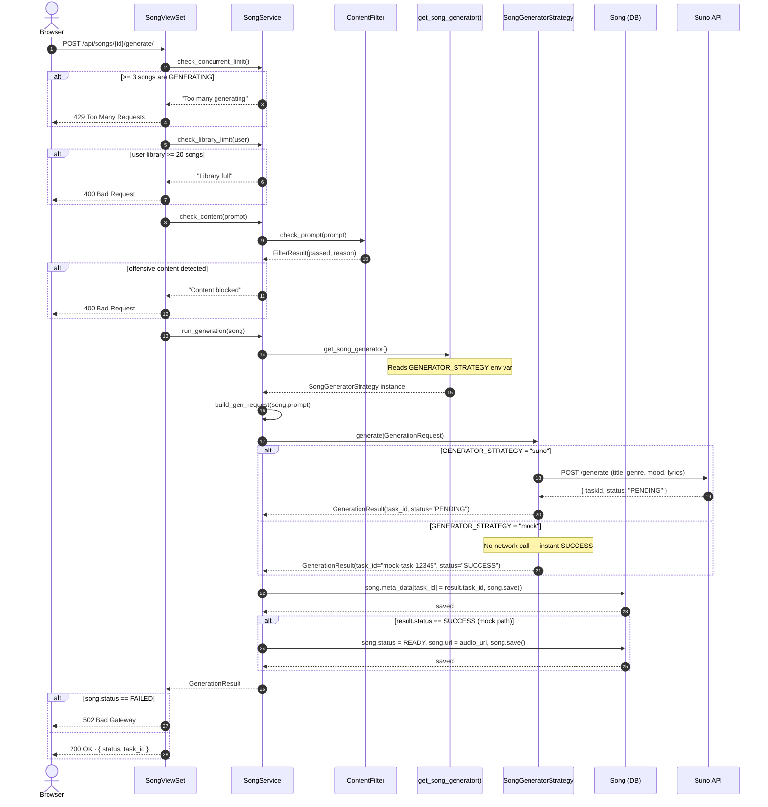
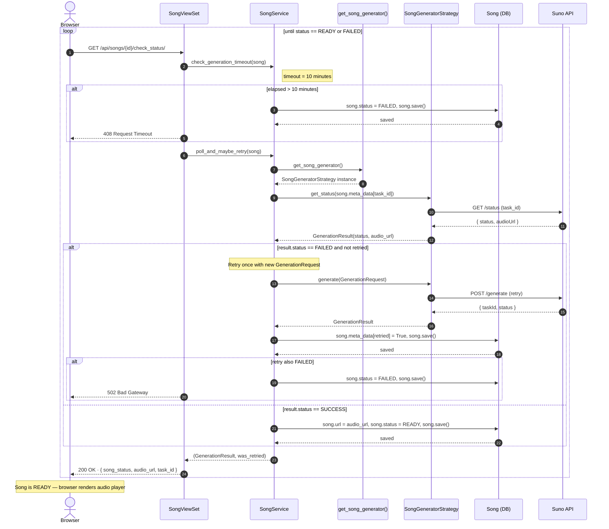

# Cithara — AI Music Generator

> A Django REST Framework application that lets users generate AI-powered songs from descriptive prompts, manage a personal library, and share songs publicly via unique links.

---

## Table of Contents

- [Project Overview](#project-overview)
- [Architecture](#architecture)
- [Domain Model](#domain-model)
- [Class Diagram](#class-diagram)
- [Sequence Diagram — Song Generation](#sequence-diagram--song-generation)
- [Technology Stack](#technology-stack)
- [Project Structure](#project-structure)
- [Setup Instructions](#setup-instructions)
- [Google OAuth Setup](#google-oauth-setup)
- [Strategy Pattern — Song Generation Engine](#strategy-pattern--song-generation-engine)
- [Authentication](#authentication)
- [API Endpoints](#api-endpoints)
- [Running Tests](#running-tests)
- [Business Rules](#business-rules)

---

## Project Overview

Cithara is a web-based song generation platform. Users fill in a **Prompt** (title, occasion, genre, mood, voice type, lyrics), and the system generates a real AI song using the Suno API. Generated songs are stored in a personal library, can be played directly in the browser, shared via a public link, or downloaded.

Key capabilities:
- AI song generation via the **Strategy pattern** (swappable between Mock and Suno)
- JWT authentication + Google OAuth 2.0
- Personal song library with a 20-song cap
- Public share links and downloads via UUID tokens
- Profanity / content filtering before generation
- Automatic retry on generation failure, 10-minute timeout guard

---

## Architecture

Cithara follows Django's **MVT (Model–View–Template)** architecture with a dedicated **Service layer** for business logic and a **Strategy pattern** for the generation engine.

```
Browser
   │
   ▼
Template (HTML + JS)          ← user/templates/, song/templates/
   │  API calls (fetch)
   ▼
View / ViewSet                ← song/views.py, user/views/
   │
   ▼
Serializer  ──«Adapter»──▶   JSON ↔ Python object translation
   │
   ▼
Service                       ← song/services.py  (business rules)
   │
   ├──▶ ContentFilter         ← profanity check
   ├──▶ get_song_generator()  ← factory reads GENERATOR_STRATEGY env var
   │         │
   │    ┌────┴────┐
   │    ▼         ▼
   │  Mock      Suno           ← concrete strategies
   │  Strategy  Strategy
   ▼
Model / DB                    ← song/models/, user/models/
```

---

## Domain Model

| Entity | Description |
|--------|-------------|
| `Prompt` | Song generation request — stores title, occasion, genre, mood, voice type, lyrics |
| `Song` | Generated song — stores audio URL, status, metadata, and links back to its Prompt |
| `SongShareLink` | UUID token that lets unauthenticated users access a specific song publicly |
| `User` | Profile model wrapping Django's built-in `AuthUser`, holds the song library (max 20) |
| `PasswordResetToken` | UUID token emailed to users for password reset |
| `Genre` | Enum — `POP`, `ROCK`, `JAZZ`, `CLASSICAL`, `RNB` |
| `Mood` | Enum — `HAPPY`, `SAD`, `ENERGETIC`, `RELAXED` |
| `SongStatus` | Enum — `GENERATING`, `READY`, `FAILED` |

---

## Class Diagram

```mermaid
classDiagram

%% ─── Enums ───────────────────────────────────────────────
class Genre {
    <<enumeration>>
    POP
    ROCK
    JAZZ
    CLASSICAL
    RNB
}

class Mood {
    <<enumeration>>
    HAPPY
    SAD
    ENERGETIC
    RELAXED
}

class SongStatus {
    <<enumeration>>
    GENERATING
    READY
    FAILED
}

%% ─── Models ──────────────────────────────────────────────
class Prompt {
    +int id
    +str title
    +str description
    +str occasion
    +Genre genre
    +Mood mood
    +str voice_type
    +str lyrics
    +datetime created_at
    +datetime updated_at
    +__str__() str
}

class Song {
    +int id
    +str title
    +str description
    +dict meta_data
    +FileField audio_file
    +str url
    +SongStatus status
    +int prompt_id
    +datetime created_at
    +datetime updated_at
    +__str__() str
}

class SongShareLink {
    +int id
    +UUID token
    +datetime created_at
    +datetime expires_at
    +is_valid() bool
    +__str__() str
}

class User {
    +datetime created_at
    +datetime updated_at
    +song_count() int
    +can_add_songs() bool
    +__str__() str
}

class PasswordResetToken {
    +int id
    +UUID token
    +datetime created_at
    +datetime expires_at
    +bool used
    +is_valid() bool
}

class AuthUser {
    <<Django built-in>>
    +str username
    +str email
    +str first_name
    +str last_name
    +datetime date_joined
}

%% ─── Views ───────────────────────────────────────────────
class PromptViewSet {
    <<ViewSet>>
    +list()
    +create()
    +retrieve()
    +update()
    +destroy()
    +songs(pk)
}

class SongViewSet {
    <<ViewSet>>
    +list()
    +create()
    +retrieve()
    +update()
    +destroy()
    +generate(pk)
    +check_status(pk)
    +mark_ready(pk)
    +mark_failed(pk)
    +share(pk)
    +play(token)
    +download(token)
    -_get_audio_url(song, request)
}

class LoginView {
    <<APIView>>
    +post(request)
}

class LogoutView {
    <<APIView>>
    +post(request)
}

class GoogleAuthRedirectView {
    <<APIView>>
    +get(request)
}

class GoogleCallbackView {
    <<APIView>>
    +get(request)
}

class ForgotPasswordView {
    <<APIView>>
    +post(request)
}

class ResetPasswordView {
    <<APIView>>
    +post(request)
}

class UserViewSet {
    <<ViewSet>>
    +list()
    +create()
    +retrieve()
    +update()
    +destroy()
    +library(pk)
    +add_song(pk)
    +remove_song(pk)
}

%% ─── Serializers (Adapter pattern) ───────────────────────
class PromptSerializer {
    <<Serializer>>
    +songs_count: int
    +get_songs_count() int
}

class SongListSerializer {
    <<Serializer>>
    +prompt_title: str
}

class SongDetailSerializer {
    <<Serializer>>
    +prompt: PromptSerializer
    +prompt_id: int
}

class SongCreateSerializer {
    <<Serializer>>
    +create(validated_data)
}

class UserListSerializer {
    <<Serializer>>
    +get_song_count() int
    +get_can_add_songs() bool
}

class UserDetailSerializer {
    <<Serializer>>
    +validate_library(value)
}

class UserCreateSerializer {
    <<Serializer>>
    +create(validated_data)
}

%% ─── Service ─────────────────────────────────────────────
class SongService {
    <<service>>
    +MAX_CONCURRENT_GENERATING = 3
    +check_concurrent_limit() str
    +check_library_limit(user) str
    +check_content(prompt) str
    +run_generation(song) GenerationResult
    +check_generation_timeout(song) bool
    +poll_and_maybe_retry(song) tuple
    +build_gen_request(prompt) GenerationRequest
}

%% ─── Strategy pattern ────────────────────────────────────
class SongGeneratorStrategy {
    <<abstract>>
    +generate(request)* GenerationResult
    +get_status(task_id)* GenerationResult
}

class MockSongGeneratorStrategy {
    +generate(request) GenerationResult
    +get_status(task_id) GenerationResult
}

class SunoSongGeneratorStrategy {
    +generate(request) GenerationResult
    +get_status(task_id) GenerationResult
}

class GenerationRequest {
    <<dataclass>>
    +int prompt_id
    +str title
    +str occasion
    +str genre
    +str mood
    +str voice_type
    +str lyrics
}

class GenerationResult {
    <<dataclass>>
    +str task_id
    +str audio_url
    +str status
    +dict raw_response
}

class get_song_generator {
    <<factory>>
    +get_song_generator() SongGeneratorStrategy
}

class ContentFilter {
    +check_prompt(prompt) FilterResult
}

%% ─── Relationships ───────────────────────────────────────
Prompt "1" --> "0..*" Song : prompt FK
Song "1" --> "1" SongShareLink : OneToOne
User "0..*" --> "0..20" Song : library M2M
User "1" --> "1" AuthUser : OneToOne
PasswordResetToken "0..*" --> "1" AuthUser : user FK

Prompt ..> Genre : uses
Prompt ..> Mood : uses
Song ..> SongStatus : uses

PromptViewSet ..> PromptSerializer : uses
SongViewSet ..> SongListSerializer : uses
SongViewSet ..> SongDetailSerializer : uses
SongViewSet ..> SongCreateSerializer : uses
SongViewSet ..> SongService : uses
UserViewSet ..> UserListSerializer : uses
UserViewSet ..> UserDetailSerializer : uses
UserViewSet ..> UserCreateSerializer : uses

SongDetailSerializer ..> PromptSerializer : nests
UserDetailSerializer ..> SongListSerializer : nests

SongService ..> get_song_generator : calls
SongService ..> ContentFilter : calls
SongService ..> GenerationRequest : creates
SongService ..> GenerationResult : reads

MockSongGeneratorStrategy --|> SongGeneratorStrategy
SunoSongGeneratorStrategy --|> SongGeneratorStrategy
get_song_generator ..> SongGeneratorStrategy : returns
```



---

## Sequence Diagram — Song Generation

### Part 1 · POST /api/songs/{id}/generate/



### Part 2 · GET /api/songs/{id}/check_status/ — poll until READY or FAILED



---

## Technology Stack

| Layer | Technology | Version |
|-------|-----------|---------|
| Backend | Django | 6.0.3 |
| REST API | Django REST Framework | 3.17.0 |
| Authentication | djangorestframework-simplejwt | 5.5.1 |
| OAuth | Google OAuth 2.0 | — |
| Filtering | django-filter | 25.2 |
| Content filter | better-profanity | 0.7.0 |
| Database | SQLite (development) | — |
| Language | Python | 3.13+ |

---

## Project Structure

```
Cithara/
├── Cithara/                  # Project config
│   ├── settings.py
│   ├── urls.py
│   └── wsgi.py
│
├── song/                     # Song domain
│   ├── models/
│   │   ├── genre.py          # Genre enum
│   │   ├── mood.py           # Mood enum
│   │   ├── song_status.py    # SongStatus enum
│   │   ├── prompt.py         # Prompt model
│   │   ├── song.py           # Song model
│   │   └── song_share_link.py
│   ├── serializers/          # One class per file (Adapter pattern)
│   │   ├── prompt_serializer.py
│   │   ├── song_list_serializer.py
│   │   ├── song_detail_serializer.py
│   │   └── song_create_serializer.py
│   ├── generation/           # Strategy pattern
│   │   ├── base.py           # Abstract strategy + dataclasses
│   │   ├── mock_strategy.py  # Offline strategy
│   │   ├── suno_strategy.py  # Real Suno API strategy
│   │   ├── factory.py        # Reads GENERATOR_STRATEGY env var
│   │   └── content_filter.py # Profanity filter
│   ├── views.py              # PromptViewSet, SongViewSet
│   ├── services.py           # Business logic
│   ├── urls.py
│   └── templates/song/
│
├── user/                     # User domain
│   ├── models/
│   │   ├── user.py           # User profile model
│   │   └── password_reset.py # PasswordResetToken model
│   ├── serializers/          # One class per file
│   │   ├── auth_user_serializer.py
│   │   ├── user_list_serializer.py
│   │   ├── user_detail_serializer.py
│   │   └── user_create_serializer.py
│   ├── views/                # One class per file
│   │   ├── auth_views.py     # LoginView, LogoutView
│   │   ├── user_views.py     # UserViewSet
│   │   ├── google_auth_redirect_view.py
│   │   ├── google_callback_view.py
│   │   ├── forgot_password_view.py
│   │   ├── reset_password_view.py
│   │   └── template_views.py
│   ├── urls.py
│   └── templates/user/
│
├── templates/
│   └── base.html
│
├── requirements.txt
├── manage.py
└── .env.example
```

---

## Setup Instructions

### Prerequisites

- Python 3.8+
- pip
- Git

### Installation

1. **Clone the repository**
   ```bash
   git clone https://github.com/LylatierN/Cithara.git
   cd Cithara
   ```

2. **Create and activate a virtual environment**
   ```bash
   python3 -m venv .venv
   source .venv/bin/activate       # Windows: .venv\Scripts\activate
   ```

3. **Install dependencies**
   ```bash
   pip install -r requirements.txt
   ```

4. **Set up environment variables**

   Copy the example file:
   ```bash
   cp .env.example .env
   ```

   Edit `.env`:
   ```env
   SECRET_KEY=your-django-secret-key
   GENERATOR_STRATEGY=mock
   SUNO_API_KEY=your-suno-api-key-here
   GOOGLE_CLIENT_ID=your-google-client-id
   GOOGLE_CLIENT_SECRET=your-google-client-secret
   EMAIL_BACKEND=django.core.mail.backends.console.EmailBackend
   ```

   | Variable | Required | Description |
   |----------|----------|-------------|
   | `SECRET_KEY` | Yes | Django secret key |
   | `GENERATOR_STRATEGY` | Yes | `mock` (offline) or `suno` (real AI) |
   | `SUNO_API_KEY` | Only for `suno` | API key from [sunoapi.org](https://sunoapi.org/api-key) |
   | `GOOGLE_CLIENT_ID` | Only for Google login | Google OAuth client ID |
   | `GOOGLE_CLIENT_SECRET` | Only for Google login | Google OAuth client secret |
   | `EMAIL_BACKEND` | No | Default prints reset emails to terminal |

   > ⚠️ Never commit `.env` to GitHub — it is in `.gitignore`.

5. **Run migrations**
   ```bash
   python manage.py makemigrations
   python manage.py migrate
   ```

6. **Create a superuser** (optional, for `/admin/`)
   ```bash
   python manage.py createsuperuser
   ```

7. **Start the development server**
   ```bash
   python manage.py runserver
   ```

8. **Access the application**

   | URL | Description |
   |-----|-------------|
   | `http://127.0.0.1:8000/login/` | Login page |
   | `http://127.0.0.1:8000/dashboard/` | Song dashboard |
   | `http://127.0.0.1:8000/api/` | Browsable API root |
   | `http://127.0.0.1:8000/admin/` | Django admin |

---

## Google OAuth Setup

1. Go to [Google Cloud Console](https://console.cloud.google.com/)
2. Create a project → **APIs & Services → Credentials**
3. Click **Create Credentials → OAuth 2.0 Client ID**
4. Set type to **Web application**
5. Add this to **Authorised redirect URIs**:
   ```
   http://localhost:8000/api/auth/google/callback/
   ```
6. Copy the **Client ID** and **Client Secret** into your `.env`

> ⚠️ Google OAuth only works on `localhost` in development. For production, add your domain to the redirect URIs in Google Cloud Console.

OAuth flow:
- `GET /api/auth/google/` — redirects to Google consent screen
- `GET /api/auth/google/callback/` — exchanges auth code for tokens, creates or retrieves the user, returns JWT pair

---

## Strategy Pattern — Song Generation Engine

The generation engine uses the **Strategy design pattern** — the concrete implementation is selected at runtime via an environment variable. Swapping strategies requires no code changes anywhere.

```
song/generation/
├── base.py            # Abstract base + GenerationRequest + GenerationResult dataclasses
├── mock_strategy.py   # MockSongGeneratorStrategy  — offline, instant, no API key needed
├── suno_strategy.py   # SunoSongGeneratorStrategy  — real AI via Suno API
├── factory.py         # get_song_generator() reads GENERATOR_STRATEGY and returns instance
└── content_filter.py  # Profanity filter applied before every generation
```

### Switching strategy

```env
GENERATOR_STRATEGY=mock   # development / testing — no API key needed
GENERATOR_STRATEGY=suno   # production — requires SUNO_API_KEY
```

### Mock mode — quick test

```bash
# 1. Obtain a token
curl -X POST http://127.0.0.1:8000/api/auth/login/ \
  -H "Content-Type: application/json" \
  -d '{"username": "your-username", "password": "your-password"}'

# 2. Create a prompt
curl -X POST http://127.0.0.1:8000/api/prompts/ \
  -H "Authorization: Bearer <access_token>" \
  -H "Content-Type: application/json" \
  -d '{"title":"Birthday Song","description":"Upbeat","occasion":"Birthday","genre":"POP","mood":"HAPPY","voice_type":"Female","lyrics":""}'

# 3. Create a song
curl -X POST http://127.0.0.1:8000/api/songs/ \
  -H "Authorization: Bearer <access_token>" \
  -H "Content-Type: application/json" \
  -d '{"title":"Birthday Song","description":"","prompt":1,"status":"GENERATING","meta_data":{}}'

# 4. Trigger generation — returns READY instantly
curl -X POST http://127.0.0.1:8000/api/songs/1/generate/ \
  -H "Authorization: Bearer <access_token>"
```

### Suno mode — real AI generation

After triggering generation, poll every 30–40 seconds until `song_status` is `READY`:

```bash
curl http://127.0.0.1:8000/api/songs/1/check_status/ \
  -H "Authorization: Bearer <access_token>"
```

---

## Authentication

All API endpoints require a JWT access token except the ones listed below.

**Public endpoints (no token needed):**

| Endpoint | Description |
|----------|-------------|
| `POST /api/auth/login/` | Obtain JWT tokens |
| `POST /api/users/` | Register a new account |
| `GET /api/songs/play/{token}/` | Public song player |
| `GET /api/songs/download/{token}/` | Public song download |

**Token settings:**

| Setting | Value |
|---------|-------|
| Access token lifetime | 30 minutes |
| Refresh token lifetime | 7 days |

Include the token in every authenticated request:
```
Authorization: Bearer <access_token>
```

---

## API Endpoints

### Auth

| Method | Endpoint | Auth | Description |
|--------|----------|:----:|-------------|
| `POST` | `/api/auth/login/` | — | Obtain JWT access + refresh tokens |
| `POST` | `/api/auth/logout/` | ✓ | Invalidate the current session |
| `POST` | `/api/auth/refresh/` | — | Refresh an access token |
| `GET` | `/api/auth/google/` | — | Redirect to Google OAuth |
| `GET` | `/api/auth/google/callback/` | — | Handle Google OAuth callback |
| `POST` | `/api/auth/forgot-password/` | — | Send password reset email |
| `POST` | `/api/auth/reset-password/` | — | Reset password using token |

### Users

| Method | Endpoint | Auth | Description |
|--------|----------|:----:|-------------|
| `GET` | `/api/users/` | ✓ | List all users |
| `POST` | `/api/users/` | — | Register a new user |
| `GET` | `/api/users/{id}/` | ✓ | Retrieve user |
| `PUT` | `/api/users/{id}/` | ✓ | Full update |
| `PATCH` | `/api/users/{id}/` | ✓ | Partial update |
| `DELETE` | `/api/users/{id}/` | ✓ | Delete user |
| `GET` | `/api/users/{id}/library/` | ✓ | Get song library |
| `POST` | `/api/users/{id}/add_song/` | ✓ | Add song to library |
| `POST` | `/api/users/{id}/remove_song/` | ✓ | Remove song from library |

### Prompts

| Method | Endpoint | Auth | Description |
|--------|----------|:----:|-------------|
| `GET` | `/api/prompts/` | ✓ | List prompts |
| `POST` | `/api/prompts/` | ✓ | Create prompt |
| `GET` | `/api/prompts/{id}/` | ✓ | Retrieve prompt |
| `PUT` | `/api/prompts/{id}/` | ✓ | Full update |
| `PATCH` | `/api/prompts/{id}/` | ✓ | Partial update |
| `DELETE` | `/api/prompts/{id}/` | ✓ | Delete prompt |
| `GET` | `/api/prompts/{id}/songs/` | ✓ | List songs from this prompt |

### Songs

| Method | Endpoint | Auth | Description |
|--------|----------|:----:|-------------|
| `GET` | `/api/songs/` | ✓ | List songs |
| `POST` | `/api/songs/` | ✓ | Create song |
| `GET` | `/api/songs/{id}/` | ✓ | Retrieve song |
| `PUT` | `/api/songs/{id}/` | ✓ | Full update |
| `PATCH` | `/api/songs/{id}/` | ✓ | Partial update |
| `DELETE` | `/api/songs/{id}/` | ✓ | Delete song |
| `POST` | `/api/songs/{id}/generate/` | ✓ | Trigger AI generation |
| `GET` | `/api/songs/{id}/check_status/` | ✓ | Poll generation status |
| `GET` | `/api/songs/{id}/share/` | ✓ | Generate public share link |
| `GET` | `/api/songs/play/{token}/` | — | Public player — returns title + audio URL |
| `GET` | `/api/songs/download/{token}/` | — | Public download — 302 redirect to audio |

---

## Running Tests

```bash
source .venv/bin/activate
python manage.py test
```

Expected output:

```
Found 24 test(s).
........................
----------------------------------------------------------------------
Ran 24 tests in X.XXXs

OK
```

Test coverage:

| Area | Tests |
|------|-------|
| Prompt + Song CRUD | ✓ |
| Song generation (mock) | ✓ |
| Concurrent generation limit | ✓ |
| Generation retry on failure | ✓ |
| Retry not called twice | ✓ |
| Generation timeout (10 min) | ✓ |
| Share link + public player | ✓ |
| Public download | ✓ |
| User CRUD + library actions | ✓ |

---

## Business Rules

| Rule | Detail |
|------|--------|
| Concurrent generation limit | Max 3 songs with `GENERATING` status at once — returns `429` |
| Library cap | Max 20 songs per user library — returns `400` |
| Content filter | Profanity check on prompt before generation — returns `400` |
| Generation timeout | Song auto-marked `FAILED` after 10 minutes — returns `408` |
| Automatic retry | One automatic retry if Suno returns `FAILED` on status poll |
| Share link uniqueness | `GET /share/` on the same song always returns the same token |
| Public access | Play and download endpoints require only the UUID token, no login |

---
## Contrubuter
6710545601 Nattanan Pimjaipong